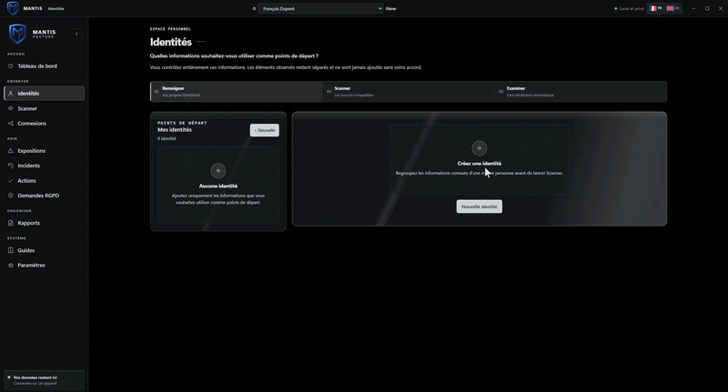
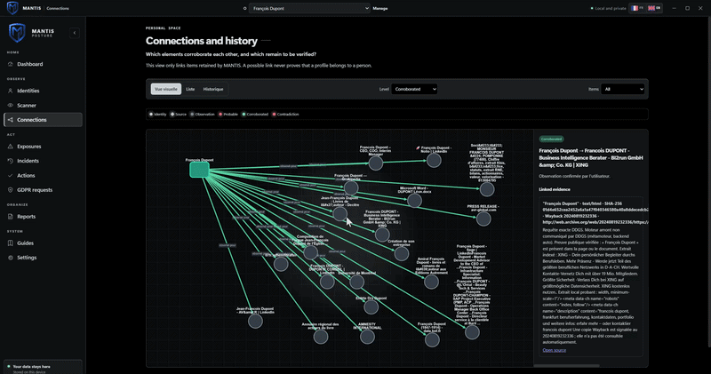

<div align="center">


# MANTIS POSTURE

> ### Track your public online footprint
>
> I am not a professional software developer, an OSINT specialist, or have any experience in software devllopement.
>
> MANTIS POSTURE started as a personal learning project: a way for me to experiment with LLMs, UI disign, public-data research, privacy concepts, and safer ways to review a digital footprint.
>
> I am sharing it because I had fun building it and thought it might be interesting to have some feedback on it.

[](#)
[](#installation)
[](#installation)
[](#privacy-by-design)
[](#privacy-by-design)
[](#license)

<br>

**Your public footprint already exists.**  
**MANTIS Posture  helps you keep track.**

<br>

`LOCAL-FIRST` · `HUMAN-IN-THE-LOOP` · `EVIDENCE-BASED` · `NO TELEMETRY`

</div>

---


<div align="center">



</div>

<br>


> [!WARNING]
> **The local AI features do not work at this stage.**

## See. Verify. Decide.

Traditional OSINT tools often blur the line between search results, assumptions, and conclusions.

MANTIS follows a different discipline: it separates what is **declared**, **observed**, **proven**, **uncertain**, and **decided**.

```text
┌──────────────────────┐
│   DECLARED DATA      │  What you choose to enter
└──────────┬───────────┘
           │
           ▼
┌──────────────────────┐
│  BOUNDED PUBLIC      │  Explicit and limited requests
│      SOURCES         │
└──────────┬───────────┘
           │
           ▼
┌──────────────────────┐
│ OBSERVATIONS +       │  URL, date, source, target, context
│     EVIDENCE         │
└──────────┬───────────┘
           │
           ▼
┌──────────────────────┐
│    HUMAN REVIEW      │  You review, confirm, or dismiss
└──────────┬───────────┘
           │
           ▼
┌──────────────────────┐
│ TRACEABLE DECISION   │  Exposure, Incident, or Action
└──────────────────────┘
```

- Entered data is not evidence
- An observation is not a conclusion
- A correlation is not an identity
- AI may explain, but it does not decide
- Meaningful actions remain human decisions

## The workflow

```text
Enter → Scan → Review → Decide → Act
```

| Step | What remains under your control |
|---|---|
| **Enter** | Create an identity and add only identifiers you are authorized to analyze |
| **Scan** | Choose sources and explicitly start the verification |
| **Review** | Inspect results, evidence, contradictions, and uncertainty levels |
| **Decide** | Confirm, dismiss, or keep an observation for later review |
| **Act** | Create an Exposure, Incident, or Action after human review |


<div align="center">




</div>

<br>

# Capabilities

MANTIS queries public sources compatible with the identifiers you provide and are authorized to analyze.

| Source | Possible observation type |
|---|---|
| XposedOrNot | Known email exposure information |
| DDGS | Public Web search results |
| User Scanner | Public traces related to an identifier |
| Maigret | Potential username presence |
| GitHub / GitLab | Public profiles, repositories, and metadata |
| Mastodon / Bluesky | Public profiles and posts |
| Gravatar | Associated public avatar or profile |
| Keybase | Published identities and proofs |
| Hacker News | Public accounts and activity |
| Company Search | Publicly accessible company information |
| HAL | Public academic publications and affiliations |

Every source is:

- **Bounded**: it stays within its defined functional scope
- **Isolated**: one engine failing does not compromise the rest of the scan
- **Documented**: its limits and behavior are explicitly described
- **Explicit**: no request is made without user action
- **Observable**: errors, timeouts, and unavailability are distinguished from no-result outcomes

> [!NOTE]
> No result does not prove that data does not exist.  
> A result does not prove that it belongs to you.

## Evidence, not assertions

Each observation can retain the information required for human review:

- Original source
- Visited URL
- Collection date
- Queried identifier
- Uncertainty level
- Review status
- Known or declared contradictions
- Link to preserved evidence
- Associated human decision, if one exists

MANTIS never automatically creates an Exposure, Incident, or Action from a simple search result.


## A dashboard built for decisions

The dashboard is designed to avoid drowning you in raw results. It highlights what actually deserves attention.

- Active identity
- Latest scan session
- Priority observations
- Items awaiting a decision
- Contradictions to investigate
- Actions in progress
- Preserved evidence

The **SCAN** button is the natural entry point for public monitoring: visible, deliberate, and controlled.

## Local AI : 

I tried using a small local LLM that would work on most hardware to explain scan results and give tips to less savy users, but I couldn’t make it consistently more useful than deterministic rules.
This part is under construction, its not working currently.

## Protection library

MANTIS includes local guides intended to help reduce exposure without selling the illusion of absolute security.

- Email aliases and compartmentalization
- Password managers
- MFA, passkeys, and account recovery
- VPNs and the real limits of network privacy
- Linux workstation hygiene
- GrapheneOS and mobile attack-surface reduction
- Private messaging and threat models
- Separation of digital identities
- Public-profile cleanup and control
- DPO and GDPR-related processes

> Privacy is not a button. It is a set of choices, boundaries, and habits.

# Privacy by design

MANTIS is designed to run on your machine first.

```text
Your identifiers
      ↓
Your machine
      ↓
Your local SQLite database
      ↓
Your decisions
```

| Guarantee | MANTIS behavior |
|---|---|
| Account | No account required |
| Telemetry | No telemetry |
| Passwords | Never collected |
| Cookies and tokens | Never stored |
| Automatic sending | None |
| Identity attribution | No automatic attribution |
| Database | SQLite in the application’s private storage area |
| Exports | Kept locally |
| Deletion | Controlled by the user |
| Network access | Limited to public sources explicitly used during a scan |
| Updates | No unsigned automatic updater |

> [!CAUTION]
> MANTIS does not make you invisible. It helps you understand what may already be visible, then lets you regain control over your choices.

# Installation

## Windows x64

The Windows installer ships collectors as standalone executables.

You do **not** need to install:

- Python
- pip
- Git
- Docker
- WSL
- An automated browser

On first launch, MANTIS verifies sidecars using a private manifest and SHA-256 hashes.

Modules can be:

- Diagnosed
- Repaired
- Restored
- Uninstalled

> Removing an engine never removes existing scans, evidence, or decisions.

## Quick start

```text
 Install MANTIS POSTURE[1]
 Create an identity[2]
 Add only identifiers you are authorized to analyze[3]
 Open Scanner[4]
 Confirm authorization[5]
 Start the scan[6]
 Review the evidence[7]
 Make a decision[8]
 Create an Action if necessary[9]
```

# Release status

> [!WARNING]
> **MANTIS POSTURE v0.1.0 is a release candidate.**
>
> The product is functional, but several items still need to be completed before a fully official Windows release.

| Item | Status |
|---|---|
| Main application and core features | Available |
| SHA-256 sidecar verification | Available |
| Windows NSIS build | Available |
| Authenticode signature | Pending |
| Signature timestamping | Pending |
| Clean Windows VM validation | Pending |
| Full install / repair / restore testing | Pending |
| Testing without Python, Git, Docker, or administrator rights | Pending |
| Automatic updater | Intentionally disabled |

# Known limitations

## Public sources

Web services change, rate-limit, and sometimes disappear.

- A source may change its structure
- A source may limit requests
- A source may become temporarily unavailable
- A source may return incomplete data
- A source may block a region or IP address
- A source may produce false positives

## Public profiles

A username can be shared, reused, or impersonated.

Every profile therefore remains a **potential profile** until you review it. MANTIS does not perform automatic identity attribution.

# What MANTIS does not do

- HIBP Premium, because its API requires a paid key
- Password collection
- Cookie or token collection
- Mass Web scraping
- Pentesting
- Vulnerability exploitation
- Secret monitoring of another person
- Automatic GDPR request submission
- Automatic identity attribution
- Unsigned automatic updates

# Verification

| Check | Status |
|---|:---:|
| `npm run check` | ✅ |
| `npm run build` | ✅ |
| `cargo check` | ✅ |
| `cargo test` | ✅ 88 tests |
| Sidecar manifests | ✅ |
| SHA-256 validation | ✅ |
| Windows NSIS build | ✅ |

# Download

## Windows x64

```text
mantis-posture_0.1.0_x64-setup.exe
```

**SHA-256**

```text
CBE397E2F395D62FE72AC8D5E2DDCCC0B72C73195D4F1EFBD33544A918DA83D7  MANTIS Posture_0.1.0_x64-setup.exe
```
## Security

The latest Windows build is scanned with VirusTotal:

[](https://www.virustotal.com/gui/file/cbe397e2f395d62fe72ac8d5e2ddccc0b72c73195d4f1efbd33544a918da83d7/summary)

[View full report →](https://www.virustotal.com/gui/file/cbe397e2f395d62fe72ac8d5e2ddccc0b72c73195d4f1efbd33544a918da83d7/summary)


> [!IMPORTANT]
> This version is intended for people who want to test MANTIS POSTURE and contribute to its validation. Treat every result with care: human review remains the product’s central feature.


<div align="center">


# Documentation

- [Security](SECURITY.md)
- [Contributing](CONTRIBUTING.md)
- [Third-party notices](THIRD-PARTY-NOTICES.md)

# License

MANTIS POSTURE is distributed under the [MIT License](LICENSE).

Sidecars and third-party dependencies retain their own licenses. See [`THIRD-PARTY-NOTICES.md`](THIRD-PARTY-NOTICES.md).

---

<div align="center">


</div>
